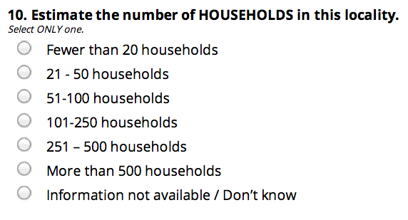
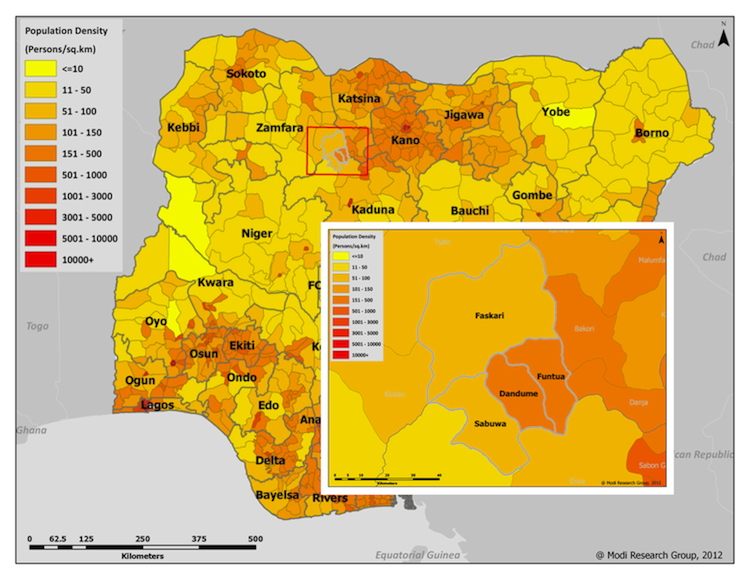
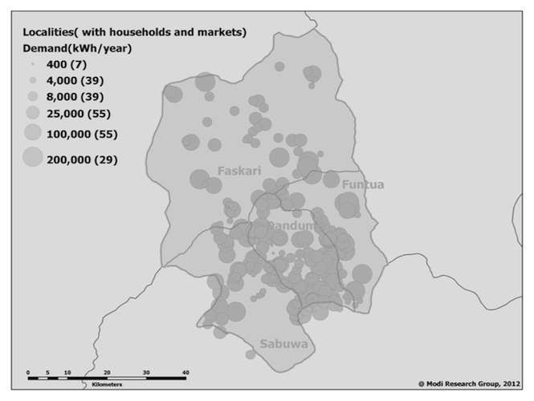
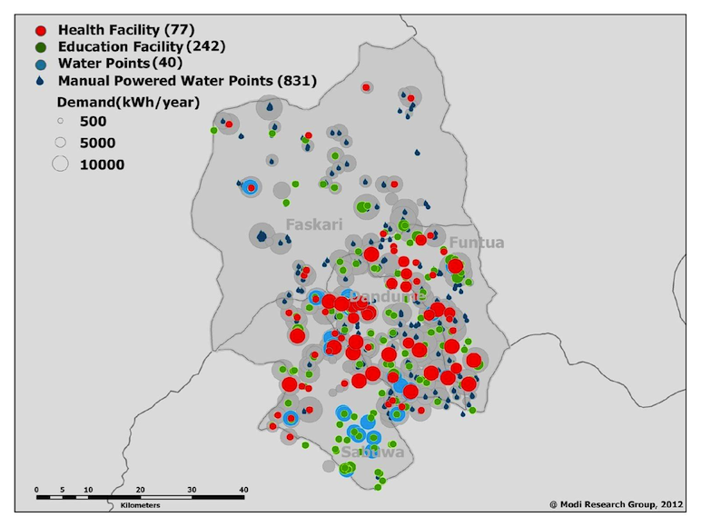
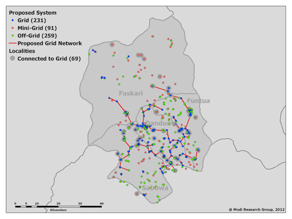

```{r echo=FALSE, warning=FALSE, message=FALSE}
setwd("~/Code/presentations/nigeria-energy-summaries/")
load('../prabhas/NigeriaPresentationUtils.RData')
library(ggplot2)
library(scales)
```

## Outline of the presentation

1. Grid data from __localities survey__

2. Grid vs. solar vs. generator data from health + education __facilities surveys__

3. Katsina -- example of detailed demand analysis

---

## 1. Localities survey

 * Geo-located population data is the key to planning and analysis, in particular demand detection.
 * Data was not possible to obtain from the Nigerian Population Commission.
 * Localities survey is an approximation. We go to each locality, and ask how many households there are.
 
 
 * A total of 23,000+ localities in 654 LGAs were surveyed.
 
---

## 1. Localities survey overview

Because of issues with the compendium of localities in Nigeria, every this surveying has uneven coverage throughout Nigeria. An overview of where data available is below; each black point is a locality. Blue “heatmap” overlay shows regions with many localities surveyed.

```{r echo=FALSE, warning=F, message=F, comment=NA, fig.height=6, fig.width=6, cache=TRUE}
library(doBy)
library(formhub)
loc <- formhubRead("data/Local_661_Merged.csv", "data/Localities_05_06_2012.json")

loc <- rename(loc, c("X_lga_id" = "lga_id"))
loc <- merge(loc, read.csv("~/Dropbox/Nigeria/Nigeria 661 Baseline Data Cleaning/lgas.csv"),
             by="lga_id")

loc$grid <- loc$grid_proximity=='connected_to_grid'
loc$hhnum <- as.numeric(recodeVar(as.character(loc$households_number), 
                       src=c("101_to_250_hh", "21_to_50_hh", "251_to_500_hh", "51_to_100_hh","less_20_hh","more_500_hh"),
                       tgt=c('175', '35', '375', '75', '10', '750'), default=NA, keep.na=T))
```
```{r echo=F, warning=F, message=F, comment=NA, fig.height=6, fig.width=6, cache=TRUE}
ggplot(data=loc, aes(x=X_gps_longitude, y=X_gps_latitude)) + 
    geom_point() + theme_blank(legend.position='none') +
    stat_density2d(aes(fill = ..level..), alpha=0.5, geom="polygon") +
    geom_map(data=states, aes(map_id=id, x=long, y=lat), 
             fill="transparent", color='#444444', map=states)

ll <- read.csv("~/Dropbox/Nigeria/Nigeria 661 Baseline Data Cleaning/lgas.csv")
ll$PopulationDensity <- cut(ll$pop_density_2006, c(0, 51, 101, 501, 1001, 5001, 10000, 100000), c("<= 50", "51-100", "101-500", "501-1000", "1001-5000", "5001-10000", "10000+"), right=FALSE)
lga_map(geom_map(data=ll, aes(map_id=lga_id, fill=PopulationDensity), map=lgas)) + 
    theme_blank() + labs(fill="Population Desnity\n(Person per Sq. Km)") + 
    guides(fill = guide_legend(nrow = 2)) 
```

---

## Example data visualization

```{r echo=F, warning=F, message=F, comment=NA, fig.height=4, fig.width=4, cache=TRUE}
lgaloc <- ddply(idata.frame(loc), .(lga_id), function(df) {
  data.frame(
    lga_id = df[1,'lga_id'],
    lga = df[1, 'lga'],
    state = df[1, 'state'],
    zone = df[1, 'zone'],
    GridPct = bool_proportion(df$grid_proximity=='connected_to_grid'),
    GridFunctional = bool_proportion_string(df$electric_grid_questions.grid_functional_yn),
    HHGridPct = ratio(ifelse(df$grid, df$hhnum, 0), df$hhnum),
    IndividualSystems = bool_proportion_string(df$individual_electricity_systems_yn)
    )
})
boxplot_by_zone(lgaloc, 'GridPct')
bin_and_map(lgaloc, 'GridPct', nostatename=TRUE)
```

<i> Throughout this presentation, we aggregate data at the LGA level to calculate a percentage of localities, such as percentage of localities with grid. The map (on the right) aggregates these into groups and plots the colors based on group; the greener the color, higher the percentage. The boxplot (on the left) shows the range of the value across LGAs in a zone. The box shows LGAs between 25th and 75th percentile, ie, the "middle 50%" of the LGAs in that zone. The center line is the median LGA, and any LGAs represented as dots are outliers.</i>


---
## What % of localities have grid?

```{r echo=F, warning=F, message=F, comment=NA, fig.height=6, fig.width=6, cache=TRUE}
boxplot_by_zone(lgaloc, 'GridPct')
bin_and_map(lgaloc, 'GridPct', nostatename=TRUE)
```
Numerator: localities in which "grid reaches (connects to) at least one structure within the locality". Denominator: all surveyed localities.

---

## What % of households have grid?
```{r echo=F, warning=F, message=F, comment=NA, fig.height=6, fig.width=6, cache=TRUE}
boxplot_by_zone(lgaloc, 'HHGridPct')
bin_and_map(lgaloc, 'HHGridPct')
```
Numerator: approximate number of households in localities where at least one structure is connected to grid. Denominator: approximate number of households in surveyed localities.

---

## What % of localities say the grid is functional?

```{r echo=F, warning=F, message=F, comment=NA, fig.height=6, fig.width=6, cache=TRUE}
boxplot_by_zone(lgaloc, 'GridFunctional')
bin_and_map(lgaloc, 'GridFunctional')
```

Denominator: localities with grid. Numerator: localities which say the grid is functional ("Functional" means that it has provided at least one hour of electricity on at least one day during the past one week to the majority of connected structures within the locality).

---

## What is the major problem with the grid?

```{r echo=F, warning=F, message=F, comment=NA, fig.height=5.5, fig.width=6, cache=TRUE}
loc$grid_problem <- 
    revalue(loc$electric_grid_questions.grid_problem, 
            c("multiple_probs_derelict"="Multiple",
              "new_not_turned_on"="New; Never turned on",
              "probs_network_1km"="In Network (<1km)",
              "probs_power_supply"="Supply",
              "probs_transformer_1km"="Transformer",
              "other"="Other", "dk"=NA, "NA"=NA
              ))
na_less_locs <- na.omit(loc[,c("lga_id", "zone", "grid_problem")])
problem_summary <- subset(ddply(idata.frame(na_less_locs), .(lga_id), function(df) {
  data.frame(MajorGridProblem = if(nrow(df) > 3) {
                                    df[which.max(df$grid_problem), 'grid_problem']
                                 } else {'NA'},
             N = nrow(df),
             lga_id = df[1,'lga_id'],
             zone=df[1,'zone']
  )
}), MajorGridProblem != 'NA')
````
This map takes the problem that is reported by most localities in LGAs as the reason for a disfunctional grid. Values are only used for LGAs in which __more than three localities responded__ with a reason grid doesn't function in their LGA. Data represents 839 localities in 101 LGAs.
Color: problem reported by the highest number of localities in an LGA.

```{r echo=F, warning=F, message=F, comment=NA, fig.height=5.5, fig.width=6, cache=TRUE}
ggplot(data=problem_summary, aes(x=zone, fill=MajorGridProblem)) + geom_bar() + 
    scale_fill_brewer(type="qual", palette=2) + 
    labs(y="Number of LGAs in zone,\nin which given problem is reported by most localities.")
lga_map(geom_map(data = problem_summary, aes(map_id = lga_id, fill = MajorGridProblem), 
                 map=lgas), filltype="qual") + theme_blank(legend.position='none')
```

---

## Use of back-up / "individual home" systems 

```{r echo=F, warning=F, message=F, comment=NA, fig.height=6, fig.width=6, cache=TRUE}
boxplot_by_zone(lgaloc, 'IndividualSystems')
bin_and_map(lgaloc, 'IndividualSystems')
```

Numerator: localities in which "ANY structures in the locality are served by individual or shared electricity systems". Denominator: surveyed localities.

---

## 2. Surveys at Health and Education Facilities
<font color="#00BFC4">Education</font> -- 69,000+ facilities, <font color="#F8766D">Health</font> -- 24,00+ facilities, across 768 LGAs.

```{r echo=FALSE, warning=F, message=F, comment=NA, fig.height=6, fig.width=6, cache=TRUE}
fac <- rbind(read.csv("data/HealthElectricityData.csv", na.strings=c("n/a","NA")),
             read.csv("data/EducationElectricityData.csv", na.strings=c("n/a","NA")))
ggplot(data=subset(fac, sector="EDUCATION")) +  
  xlim(2.6,14.7) + ylim(4.2,13.9) + theme_blank(legend.position = "none") +
  geom_point(aes(x=long, y=lat), alpha=0.2, color='#00BFC4') +  
  geom_map(data=states, aes(map_id=id), fill="transparent", color='#666666', map=states) +
  geom_text(data=stateCenters, aes(x=x, y=y, label=STATE), color='#444444')
ggplot(data=subset(fac, sector="HEALTH")) +  
  xlim(2.6,14.7) + ylim(4.2,13.9) + theme_blank(legend.position = "none") +
  geom_point(aes(x=long, y=lat), alpha=0.2, color= '#F8766D') +  
  geom_map(data=states, aes(map_id=id), fill="transparent", color='#666666', map=states) +
  geom_text(data=stateCenters, aes(x=x, y=y, label=STATE), color='#444444')

```
```{r echo=FALSE, warning=F, message=F, comment=NA, fig.height=6, fig.width=12, cache=TRUE}
facagg <- ddply(idata.frame(fac), .(lga_id), function(df) {
  data.frame(
    lga_id = df[1,'lga_id'],
    FunctionalPower_Health = bool_proportion(df$functional_power, df$sector=="HEALTH"),
    FunctionalPower_Education = bool_proportion(df$functional_power, df$sector=="EDUCATION"),
    Grid = bool_proportion(df$grid),
    Solar = bool_proportion(df$solar),
    Generator = bool_proportion(df$genset),
    PercentGridInPoweredFacilities = bool_proportion(df$grid, df$grid | df$solar | df$genset),
    PercentSolarInPoweredFacilities = bool_proportion(df$solar, df$grid | df$solar | df$genset),
    PercentGeneratorInPoweredFacilities = bool_proportion(df$genset, df$grid | df$solar | df$genset),
    PercentGridInFunctionalPowerFacilities = bool_proportion(df$grid, df$functional_power),
    PercentSolarInFunctionalPowerFacilities = bool_proportion(df$solar, df$functional_power),
    PercentGeneratorInFunctionalPowerFacilities = bool_proportion(df$genset, df$functional_power),
    GridFunctional = bool_proportion(df$grid_functional=='yes', df$grid),
    #SolarFunctional = bool_proportion(df$solar_functional=='yes', df$solar), 
    GeneratorFunctional = bool_proportion(df$generator_functional=='yes', df$genset)
  )
})
lgaas <- read.csv('~/Dropbox/Nigeria/Nigeria 661 Baseline Data Cleaning/lgas.csv')
facagg <- merge(facagg, lgaas, by="lga_id")
```
---

## Functional Power in Health Facilities

```{r echo=F, warning=F, message=F, comment=NA, fig.height=6, fig.width=6, cache=TRUE}
boxplot_by_zone(facagg, 'FunctionalPower_Health')
bin_and_map(facagg, 'FunctionalPower_Health', nostatename=TRUE)
```
Numerator: health facilities in which pwoer is _functional_. Denominator: all health facilities in LGA.

---

## Functional Power in Schools

```{r echo=F, warning=F, message=F, comment=NA, fig.height=6, fig.width=6, cache=TRUE}
boxplot_by_zone(facagg, 'FunctionalPower_Education')
bin_and_map(facagg, 'FunctionalPower_Education', nostatename=TRUE)
```

Numerator: schools in which there is _functional_ power. Denominator: all schools in LGA.

---


## Ouf of facilities with power, which use ...

```{r echo=F, warning=F, message=F, comment=NA, fig.height=4, fig.width=4, cache=TRUE}
boxplot_by_zone(facagg, 'PercentGridInPoweredFacilities')
boxplot_by_zone(facagg, 'PercentGeneratorInPoweredFacilities')
boxplot_by_zone(facagg, 'PercentSolarInPoweredFacilities')
bin_and_map(facagg, 'PercentGridInPoweredFacilities', nostatename=TRUE)
bin_and_map(facagg, 'PercentGeneratorInPoweredFacilities', nostatename=TRUE)
bin_and_map(facagg, 'PercentSolarInPoweredFacilities', nostatename=TRUE)
```
Numerator: facility with given type of power source. Denominator: all facilities that have power.

---

## Which sources are more functional?

```{r echo=F, warning=F, message=F, comment=NA, fig.height=3.5, fig.width=3.5, cache=TRUE}
boxplot_by_zone(facagg, 'GridFunctional')
boxplot_by_zone(facagg, 'GeneratorFunctional')
```
```{r echo=F, warning=F, message=F, comment=NA, fig.height=3.5, fig.width=3.5, cache=TRUE}
bin_and_map(facagg, 'GridFunctional', nostatename=TRUE)
bin_and_map(facagg, 'GeneratorFunctional', nostatename=TRUE)
```
Numerator: facilities with given source of power, in which the power is functional. Denominator: facilities with given source of power.


---

    
## 3. A detailed look at 4 LGAs in Katsina


---


## Localities sized by demand
 

Demand derived from approximate number of households and market structures.

```{r echo=F, warning=F, message=F, comment=NA, fig.height=6, fig.width=6, cache=TRUE}
four_fac <- subset(fac, lga_id %in% c(146, 223, 228, 661))
four_fac$WhichSystem <- ifelse(four_fac$grid, 'GRID', ifelse(four_fac$solar, 'SOLAR',
                  ifelse(four_fac$genset, 'GENERATOR', 'NONE')))

four_loco <- subset(loc, lga_id %in% c(146, 223, 228, 661))
four_loco$sector <- 'LOCALITIES'
four_loco <- rename(four_loco, c("X_gps_latitude"="lat", "four_loco$X_gps_longitude"="long"))
four_loco$WhichSystem <- ifelse(four_loco$grid, 'GRID', 'NO-GRID')
four_loco$funtional_power <- as.logical(recodeVar(as.character(four_loco$electric_grid_questions.grid_functional_yn), src=c('yes', 'no'), tgt=c(TRUE, FALSE), default=NA))

four <- rbind.fill(four_fac, four_loco)
fourl <- subset(lgas, )
ggplot(data=four, aes(x=long, y=lat, color=WhichSystem)) + geom_point(aes(shape=sector)) +
  scale_color_manual(values=c('pink', muted('blue'), 'grey', 'darkgrey', 'yellow')) + xlim(c(6.9,7.38)) + ylim(c(11.1, 11.9)) + geom_point(data=subset(four, functional_power), shape=8, color='black', alpha=0.5) +
  theme(axis.title=element_blank(), axis.text=element_blank(),
        axis.ticks = element_blank(), panel.grid=element_blank(), 
        panel.background=element_rect(fill='#ffffff'),
        legend.position = "bottom") +
  geom_map(data=fl, aes(map_id=id), fill="transparent", color='#444444', map=fl)
```
---

## Cross-sectoral demand


---

## Projected Electricity Infrastructure


---

## Needed

* Better population data -- localities are a far approximation
* Existing grid lines (projection assumes no grid in previous example)
* Demand projections and international procurement costs (lots of experience)
* Project demand out to 10 years based on growth models
* Costing, financing

---

## Thank you
Sustainable Engineering Lab, Earth Institute, Columbia University

