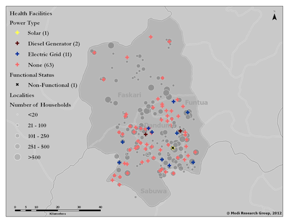

```{r echo=FALSE, warning=FALSE, message=FALSE}
setwd("~/Code/presentations/prabhas/energy-summaries/")
load('../NigeriaPresentationUtils.RData')
library(ggplot2)
library(scales)
```
## Outline
1. Grid data from localities survey
2. Grid vs. solar vs. generator data from health + education surveys
3. Katsina -- example of detailed demand analysis

---

## 1. Localities survey

Total: 23,000+ localities in 654 LGAs. Heatmap of where localities were surveyed:

```{r echo=FALSE, warning=F, message=F, comment=NA, fig.height=6, fig.width=8, cache=TRUE}
library(doBy)
source('~/Code/formhub.R/R/formhub.R')
loc <- formhubRead("data/Local_661_Merged.csv", "data/Localities_05_06_2012.json")

loc <- rename(loc, c("X_lga_id" = "lga_id"))
loc <- merge(loc, read.csv("~/Dropbox/Nigeria/Nigeria 661 Baseline Data Cleaning/lgas.csv"),
             by="lga_id")

loc$grid <- loc$grid_proximity=='connected_to_grid'
loc$hhnum <- as.numeric(recodeVar(as.character(loc$households_number), 
                       src=c("101_to_250_hh", "21_to_50_hh", "251_to_500_hh", "51_to_100_hh","less_20_hh","more_500_hh"),
                       tgt=c('175', '35', '375', '75', '10', '750'), default=NA, keep.na=T))

ggplot(data=loc, aes(x=X_gps_longitude, y=X_gps_latitude)) + geom_point() + stat_density2d(aes(fill = ..level.., alpha=0.2), geom="polygon") +
  theme(axis.title=element_blank(), axis.text=element_blank(), axis.ticks = element_blank(), 
        panel.grid=element_blank(), panel.background=element_rect(fill='#cccccc'), legend.position = "none") +
  geom_map(data=states, aes(map_id=id, x=long, y=lat), fill="transparent", color='#444444', map=states) +
  geom_text(data=stateCenters, aes(x=x, y=y, label=STATE))
```

```{r echo=F, warning=F, message=F, comment=NA, fig.height=6, fig.width=6, cache=TRUE}
lgaloc <- ddply(idata.frame(loc), .(lga_id), function(df) {
  data.frame(
    lga_id = df[1,'lga_id'],
    lga = df[1, 'lga'],
    state = df[1, 'state'],
    zone = df[1, 'zone'],
    HouseholdAggregate = sum(df$hhnum, na.rm=T),
    Population = df[1,'pop_2006'],
    Density = df[1,'pop_density_2006'],
    GridPct = bool_proportion(df$grid_proximity=='connected_to_grid'),
    GridFunctional = bool_proportion_string(df$electric_grid_questions.grid_functional_yn),
    HHGridPct = ratio(ifelse(df$grid, df$hhnum, 0), df$hhnum),
    IndividualSystems = bool_proportion_string(df$individual_electricity_systems_yn)
    )
})
```

---

## What % of localities have grid?

```{r echo=F, warning=F, message=F, comment=NA, fig.height=4.5, fig.width=5, cache=TRUE}
boxplot_by_zone(lgaloc, 'GridPct')
bin_and_map(lgaloc, 'GridPct', nostatename=TRUE)
```

<i> Throughout this presentation, we aggregate data at the LGA level to calculate a percentage of localities, such as percentage of localities with grid. The map (on the right) aggregates these into groups and plots the colors based on group; the greener the color, higher the percentage. The boxplot (on the left) shows the range of the value across LGAs in a zone. The box shows LGAs between 25th and 75th percentile, ie, the "middle 50%" of the LGAs in that zone. The center line is the median LGA, and any LGAs represented as dots are outliers.</i>

---

## What % of households have grid?
```{r echo=F, warning=F, message=F, comment=NA, fig.height=6, fig.width=6, cache=TRUE}
boxplot_by_zone(lgaloc, 'HHGridPct')
bin_and_map(lgaloc, 'HHGridPct')
```

Household numbers derived from household-number bins of  _Less than 20_, _21 to 50_, _51 to 100_, _101 to 250_, _251 to 500_ and _More than 500_ as reported by locality residents.

---

## What % of localities say the grid is functional?

```{r echo=F, warning=F, message=F, comment=NA, fig.height=6, fig.width=6, cache=TRUE}
boxplot_by_zone(lgaloc, 'GridFunctional')
bin_and_map(lgaloc, 'GridFunctional')
```

Denominator: localities with grid. Numerator: localities which say the grid is functional.

---

## What is the major problem with the grid?
This map takes the problem that is reported by most localities in LGAs as the reason for a disfunctional grid. Values are only used for LGAs in which more than two localities responded with a reason grid doesn't function in their LGA. Data represents 971 localities in 145 LGAs.
Color: problem reported by the highest number of localities in an LGA.

```{r echo=F, warning=F, message=F, comment=NA, fig.height=5.5, fig.width=6, cache=TRUE}
loc$grid_problem <- factor(recodeVar(as.character(loc$electric_grid_questions.grid_problem), src=c("multiple_probs_derelict", "new_not_turned_on", "probs_network_1km", "probs_power_supply", "probs_transformer_1km", "other"), tgt=c("Multiple", "New; Never turned on", "In Network (<1km)", "Supply", "Transformer", "Other"), default=NA))
na_less_locs <- subset(loc, !is.na(loc$grid_problem))
problem_summary <- subset(ddply(idata.frame(na_less_locs), .(lga_id), function(df) {
  data.frame(MajorGridProblem= if(nrow(df) > 2) {df[which.max(df$grid_problem), 'grid_problem']} else {'NA'},
             lga_id = df[1,'lga_id'],
             zone=df[1,'zone']
  )
}), MajorGridProblem != 'NA')
barplot_by_zone <- function(df, colname, zonecolname='zone', title=NA) {
  ggplot(data=df, aes_string(x=zonecolname, fill=colname)) + geom_bar()   +
    labs(title=ifelse(is.na(title), colname, title)) + 
    theme(axis.text.x = element_text(angle = 45, hjust = 1), axis.title.x=element_blank()) + scale_fill_brewer(type="qual", palette=2)
}; barplot_by_zone(problem_summary, 'MajorGridProblem') + ylab("Number of LGAs in zone,\nin which given problem is reported by most localities.")
lga_map(geom_map(data = problem_summary, aes(map_id = lga_id, fill = MajorGridProblem), map=lgas), filltype="qual") + theme(legend.position='none')
```

---

## Use of back-up / "individual home" systems 

```{r echo=F, warning=F, message=F, comment=NA, fig.height=6, fig.width=6, cache=TRUE}
boxplot_by_zone(lgaloc, 'IndividualSystems')
bin_and_map(lgaloc, 'IndividualSystems')
```

---

## 2. Surveys at Health and Education Facilities
<font color="#00BFC4">Education</font> -- 69,000+ facilities, <font color="#F8766D">Health</font> -- 24,00+ facilities, across 768 LGAs.

```{r echo=FALSE, warning=F, message=F, comment=NA, fig.height=6, fig.width=12, cache=TRUE}
fac <- rbind(read.csv('data/EducationElectricityData.csv', na.strings=c("n/a","NA")),
             read.csv('data/HealthElectricityData.csv', na.strings=c("n/a","NA")))
ggplot() +  
  geom_point(data=fac, aes(x=long, y=lat, color=sector, alpha=0.2)) + 
  xlim(2.6,14.7) + ylim(4.2,13.9) + scale_color_manual(values=c('#00BFC4', '#F8766D')) +
  theme(axis.title=element_blank(), axis.text=element_blank(), axis.ticks = element_blank(), 
        panel.grid=element_blank(), panel.background=element_rect(fill='#aaaaaa'),
          legend.position = "none") +
  geom_map(data=states, aes(map_id=id), fill="transparent", color='#888888', map=states) +
  geom_text(data=stateCenters, aes(x=x, y=y, label=STATE), color='#444444')
```
```{r echo=FALSE, warning=F, message=F, comment=NA, fig.height=6, fig.width=12, cache=TRUE}
facagg <- ddply(idata.frame(fac), .(lga_id), function(df) {
  data.frame(
    lga_id = df[1,'lga_id'],
    HealthFacilities = icount(df$sector=="HEALTH"),
    EduFacilities = icount(df$sector=="EDUCATION"),
    ALLFAcilities = nrow(df),
    FunctionalPower_Health = bool_proportion(df$functional_power, df$sector=="HEALTH"),
    FunctionalPower_Education = bool_proportion(df$functional_power, df$sector=="EDUCATION"),
    FunctionalPower_Overall = bool_proportion(df$functional_power),
    Grid = bool_proportion(df$grid),
    Solar = bool_proportion(df$solar),
    Generator = bool_proportion(df$genset),
    GridOutOfPower = bool_proportion(df$grid, df$grid | df$solar | df$genset),
    SolarOutOfPower = bool_proportion(df$solar, df$grid | df$solar | df$genset),
    GeneratorOutOfPower = bool_proportion(df$genset, df$grid | df$solar | df$genset),
    GridFunctional = bool_proportion(df$grid_functional=='yes', df$grid),
    SolarFunctional = bool_proportion(df$solar_functional=='yes', df$solar),
    GeneratorFunctional = bool_proportion(df$generator_functional=='yes', df$genset)
  )
})
lgaas <- read.csv('~/Dropbox/Nigeria/Nigeria 661 Baseline Data Cleaning/lgas.csv')
facagg <- merge(facagg, lgaas, by="lga_id")
```
---

## Ouf of facilities with power, which use ...

```{r echo=F, warning=F, message=F, comment=NA, fig.height=4, fig.width=4, cache=TRUE}
boxplot_by_zone(facagg, 'GridOutOfPower')
boxplot_by_zone(facagg, 'GeneratorOutOfPower')
boxplot_by_zone(facagg, 'SolarOutOfPower')
bin_and_map(facagg, 'GridOutOfPower', nostatename=TRUE)
bin_and_map(facagg, 'GeneratorOutOfPower', nostatename=TRUE)
bin_and_map(facagg, 'SolarOutOfPower', nostatename=TRUE)
```

---

## Which electric system is dominant?

```{r echo=F, warning=F, message=F, comment=NA, fig.height=6, fig.width=6, cache=TRUE}
g <- replace(facagg$Grid, is.na(facagg$Grid), 0)
s <- replace(facagg$Solar, is.na(facagg$Solar), 0)
n <- replace(facagg$Generator, is.na(facagg$Generator), 0)
gt <- (function(eps) { function(a, b) { (a - b) > eps }}) (.1)

facagg$DominantElectricSystem <- 
  ifelse(gt(g,s) & gt(g,n),'GRID',
  ifelse(gt(n,s) & gt(n,g), 'GEN',
  ifelse(gt(s,n) & gt(s,g),'SOLAR',
  # no dominance
  ifelse(gt(s,n) & gt(g,n), 'GRID | SOLAR',
  ifelse(gt(g,s) & gt(n,s), 'GEN | GRID',
  ifelse(gt(n,g) & gt(s,g), 'SOLAR | GEN',
         'No dominance'))))))
  
barplot_by_zone(facagg, 'DominantElectricSystem')  + labs(y="Number of LGAs in this zone with dominant system")
lga_map(geom_map(data = facagg, aes(map_id = lga_id, fill = DominantElectricSystem), map=lgas), filltype="qual") + theme(legend.position='none')
```
---

## What is functional?

```{r echo=F, warning=F, message=F, comment=NA, fig.height=4, fig.width=4, cache=TRUE}

boxplot_by_zone(facagg, 'GridFunctional')
boxplot_by_zone(facagg, 'GeneratorFunctional')
boxplot_by_zone(facagg, 'SolarFunctional')
bin_and_map(facagg, 'GridFunctional', nostatename=TRUE)
bin_and_map(facagg, 'GeneratorFunctional', nostatename=TRUE)
bin_and_map(facagg, 'SolarFunctional', nostatename=TRUE)

```

---

## Functional Power in Health Facilities

```{r echo=F, warning=F, message=F, comment=NA, fig.height=6, fig.width=6, cache=TRUE}
boxplot_by_zone(facagg, 'FunctionalPower_Health')
bin_and_map(facagg, 'FunctionalPower_Health', nostatename=TRUE)
```
Denominator: all health facilities in LGA.

---

## Functional Power in Schools

```{r echo=F, warning=F, message=F, comment=NA, fig.height=6, fig.width=6, cache=TRUE}
boxplot_by_zone(facagg, 'FunctionalPower_Education')
bin_and_map(facagg, 'FunctionalPower_Education', nostatename=TRUE)
```
Denominator: all schools in LGA.

---

## 3. A detailed look at 4 LGAs in Katsina


---


## Localities sized by demand
 

Demand derived from approximate number of households and market structures.

```{r echo=F, warning=F, message=F, comment=NA, fig.height=6, fig.width=6, cache=TRUE}
four_fac <- subset(fac, lga_id %in% c(146, 223, 228, 661))
four_fac$WhichSystem <- ifelse(four_fac$grid, 'GRID', ifelse(four_fac$solar, 'SOLAR',
                  ifelse(four_fac$genset, 'GENERATOR', 'NONE')))

four_loco <- subset(loc, lga_id %in% c(146, 223, 228, 661))
four_loco$sector <- 'LOCALITIES'
four_loco <- rename(four_loco, c("X_gps_latitude"="lat", "four_loco$X_gps_longitude"="long"))
four_loco$WhichSystem <- ifelse(four_loco$grid, 'GRID', 'NO-GRID')
four_loco$funtional_power <- as.logical(recodeVar(as.character(four_loco$electric_grid_questions.grid_functional_yn), src=c('yes', 'no'), tgt=c(TRUE, FALSE), default=NA))

four <- rbind.fill(four_fac, four_loco)
fourl <- subset(lgas, )
ggplot(data=four, aes(x=long, y=lat, color=WhichSystem)) + geom_point(aes(shape=sector)) +
  scale_color_manual(values=c('pink', muted('blue'), 'grey', 'darkgrey', 'yellow')) + xlim(c(6.9,7.38)) + ylim(c(11.1, 11.9)) + geom_point(data=subset(four, functional_power), shape=8, color='black', alpha=0.5) +
  theme(axis.title=element_blank(), axis.text=element_blank(),
        axis.ticks = element_blank(), panel.grid=element_blank(), 
        panel.background=element_rect(fill='#ffffff'),
        legend.position = "bottom") +
  geom_map(data=fl, aes(map_id=id), fill="transparent", color='#444444', map=fl)
```
---

## Cross-sectoral demand


---

## Existing Power Avaialability



---

## Projected Electricity Infrastructure


---

## Needed

* Better population data -- localities are a far approximation
* Existing grid lines (projection assumes no grid in previous example)
* Demand projections and international procurement costs (lots of experience)
* Project demand out to 10 years based on growth models
* Costing, financing

---

## Thank you

Modi Research Group, Earth Institute, Columbia University


---

```{r echo=F, warning=F, message=F, comment=NA, fig.height=6, fig.width=6, cache=TRUE}
bin_and_map(facagg, 'FunctionalPower_Health', nostatename=TRUE)
bin_and_map(facagg, 'FunctionalPower_Education', nostatename=TRUE)
```