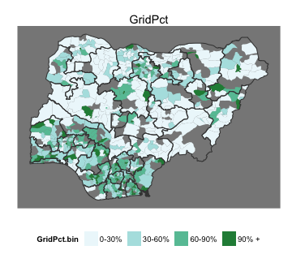

## Outline
1. Grid data from localities survey
2. Grid vs. solar vs. generator data from health + education surveys
3. Katsina -- example of detailed demand analysis

---

## Localities survey -- orientation
 


---

## What % of localities have grid?
  


---

## What % of households have grid?
  


---

## What % of localities say the grid is functional?

  


---

## What is the major problem with the grid?
Left: issues by locality, by zone. Right: Majority problem for LGA.

  


---

## Do housholds employ back-up or "individual home" systems?

  


---


## Systems of energy use in health and education facilities


```
Error: internal error -3 in R_decompress1
```

```
Error: internal error -3 in R_decompress1
```

```
Error: internal error -3 in R_decompress1
```

```
Error: internal error -3 in R_decompress1
```

```
Error: internal error -3 in R_decompress1
```

```
Error: internal error -3 in R_decompress1
```


---

## What is functional?


```
Error: internal error -3 in R_decompress1
```

```
Error: internal error -3 in R_decompress1
```

```
Error: internal error -3 in R_decompress1
```

```
Error: internal error -3 in R_decompress1
```

```
Error: internal error -3 in R_decompress1
```

```
Error: internal error -3 in R_decompress1
```

