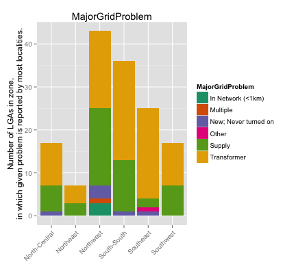
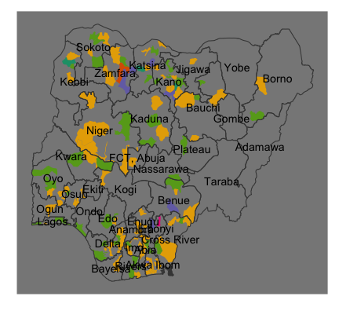
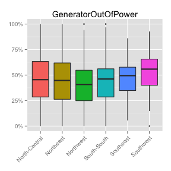
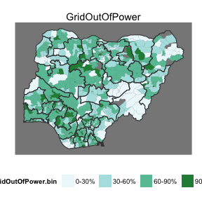
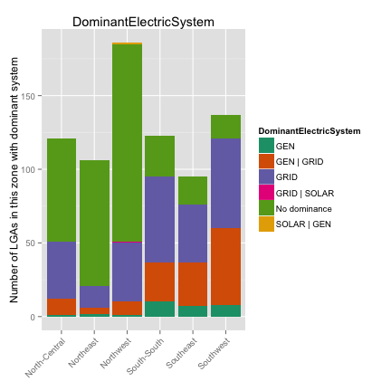
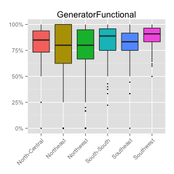
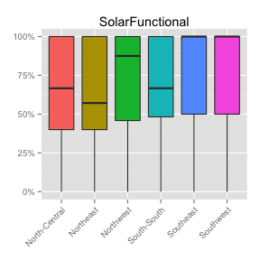
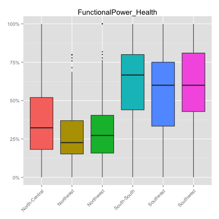

## Outline
1. Grid data from localities survey
2. Grid vs. solar vs. generator data from health + education surveys
3. Katsina -- example of detailed demand analysis

---

## 1. Localities survey

Total: 23,000+ localities in 654 LGAs. Heatmap of where localities were surveyed:

 

---

## What % of localities have grid?

  

<i> Throughout this presentation, we aggregate data at the LGA level to calculate a percentage of localities, such as percentage of localities with grid. The map (on the right) aggregates these into groups and plots the colors based on group; the greener the color, higher the percentage. The boxplot (on the left) shows the range of the value across LGAs in a zone. The box shows LGAs between 25th and 75th percentile, ie, the "middle 50%" of the LGAs in that zone. The center line is the median LGA, and any LGAs represented as dots are outliers.</i>

---

## What % of households have grid?
  

---

## What % of localities say the grid is functional?

  

Denominator: localities with grid. Numerator: localities which say the grid is functional.

---

## What is the major problem with the grid?
This map takes the problem that is reported by most localities in LGAs as the reason for not getting enough electricity. Values are only used for LGAs in which more than two localities responded with a reason grid doesn't function in their LGA. Data represents 971 localities in 145 LGAs.
Color: problem reported by the highest number of localities in an LGA.

  

---

## Use of back-up / "individual home" systems 

  

---

## 2. Surveys at Health and Education Facilities
Education -- 69,000+ facilities, Health -- 24,00+ facilities, across 768 LGAs.

 

---

## What % use ...

      

---

## Which electric system is dominant?

  

---

## What is functional?

      

---

## Functional Power in Health Facilities

  

Denominator: all health facilities in LGA.

---

## Functional Power in Schools

  

Denominator: all schools in LGA.

---

## 3. 
