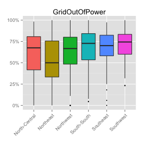
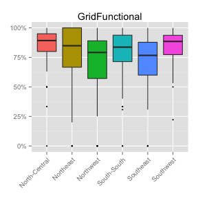

## Outline
1. Grid data from localities survey
2. Grid vs. solar vs. generator data from health + education surveys
3. Katsina -- example of detailed demand analysis

---

## Localities survey -- landscape of the data
 


---

## What % of localities have grid?
  


---

## What % of households have grid?
  


---

## What % of localities say the grid is functional?

  


---

## What is the major problem with the grid?
Left: issues by locality, by zone. Right: Majority problem for LGA.


```
Error: object 'bar' not found
```

  


---

## Use of back-up / "individual home" systems 

  


---

## 2. Surveys at Health and Education Facilities


---

## What % use ...

      


---

## Which electric system is dominant?

  

---

## What is functional?

      


---

## Functional Power

    


