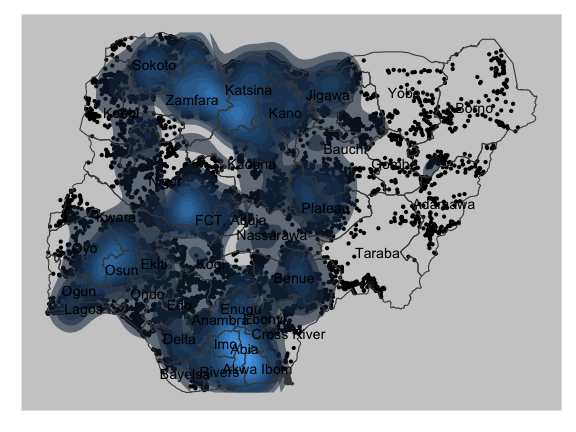
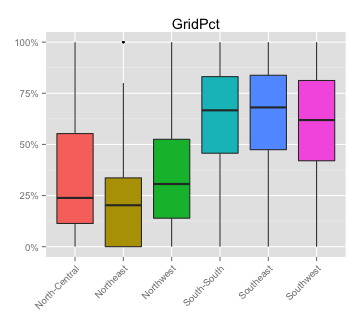
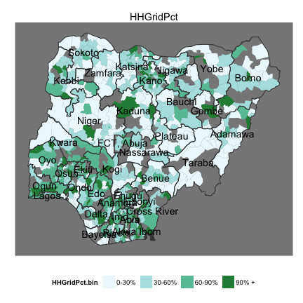

## Outline
1. Localities Survey, coverage
2. Other surveys, what data is included
3. LGA wides summaries of data
4. Katsina -- 4 LGA example of detailed demand analysis

---

## Coverage of localities survey (1)
 

---

## Coverage of localities survey (2)
Household aggregate -- taking the mid-points of the bin vs. population of LGA

  

CAVEAT TO THE REST OF THE PRESENTATION: BASED ON QUESTIONABLE COVERAGE.

---

## What % of localities have grid?
  

---

## What % of households have grid?
  

---

## What % of localities say the grid is functional?

  

---

## What is the major problem with the grid?
Where do the majority say the issue is?

  

---

## What % of localities have a mini-grid?

  

---

## What % of mini-grids are functional?

  

---
