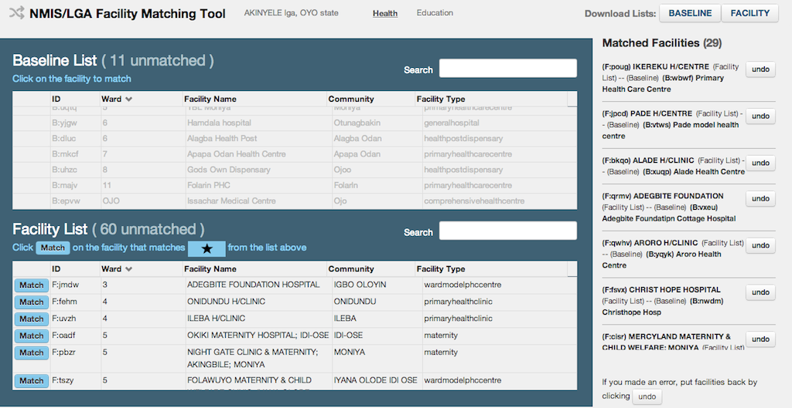
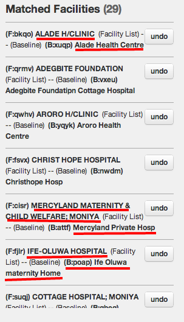

```{r echo=FALSE, warning=FALSE, message=FALSE}
setwd("~/Code/presentations/prabhas/kigali-mopup-presentation/")
source("../NigeriaPresentationUtils.R")
# importing variables... this is how we have to do it sadly
lgas <- lgas
lgashp <- lgashp
lga_map <- lga_map
flipAndPrint <- flipAndPrint
```
## Outline
1. Mopup -- a process overview
2. Outcomes of the matching process
3. Missing facilities
4. Baseline coverage, a retrospective

---

## Mopup, process overview
The stages of the mopup process include:

1. Facility Lists. Obtained by TAs, and entered using the formhub data tool to EI.
2. Data Matching. TAs matched the facilities submitted through baseline with data from baseline.
3. Analysis to scope out the work required for mopup (this presentation).
4. Teams go to field and survey the "outstanding" facilities.

---

## Facility List process overview

Facility lists were submitted for 773 of 774 LGAs. A quick visual comparison of the number of facilities per LGA, comparing the facility lists and the baseline list is belows (each point is an LGA).
Each point below the line is an LGA for which the number of facilities in the facility list was less than 80% of those in baseline; meaning the officials' lists are incomplete by a 20% margin.

```{r echo=F, warning=F, message=F, comment=NA, fig.height=4, fig.width=13, cache=TRUE}
  # may need to change the following line to get running on your computer  
library(ggplot2)
  matched <- read.csv("data/all_matched_data.csv")
  matched$ratio_fl_over_bl <- matched$total_facility_list / matched$total_baseline
  ggplot(data=matched, aes(x=total_baseline, y=total_facility_list)) + geom_point() + 
    geom_abline(slope=0.8) +
    labs(x="Total facilities from baseline", y="Total facilities from Facility Lists",
         title = "Comparison of baseline and facility lists; (slope of line = 0.8)")
```
There are  59 such lgas.

---

## Facility List Overview (2) 
```{r echo=F, warning=F, message=F, comment=NA, fig.height=8, fig.width=13, cache=TRUE}
#source("../NigeriaPresentationUtils.R")  
  matched$RatioCategory = cut(matched$ratio_fl_over_bl, breaks=c(0,.8,1.2,2.0,29), right=F,
                              labels=c("0-80% (deficient facility lists)", "80-120% (roughly equal)", "120-200% (up to double)", "200% + (more than double)"))

  lga_map(geom_map(data = matched, aes(map_id = lga_id, fill = RatioCategory), map=lgas)) +
    scale_fill_manual(values = c("#F4A582", "#F7F7F7", "#92C5DE", "#0571B0"), na.value="grey") # colorbrewer, turned 5-scale into 4-scale
```
---

## Matching process (1)



---

## Matching process (2)

Some examples of why matching is necessary:



---

## Progress towards the matching exercise
In total, 92% of the facilities in baseline have been matched.

```{r echo=F, warning=F, message=F, comment=NA, fig.height=6, fig.width=13, cache=TRUE}
  library(classInt)
  #brks <- classIntervals((matched$total_baseline - matched$left_baseline) / matched$total_baseline, n=5, style="fisher")$brks
  matched$MatchedRatio <- cut((matched$total_baseline-matched$left_baseline) / matched$total_baseline, breaks=c(0,.3,.6,.9,1), include.lowest=T, 
                              labels=c("0-30%", "30-60%", "60-90%", "90% +"))
```
```{r echo=F, warning=F, message=F, comment=NA, fig.height=7, fig.width=13, cache=TRUE}
#source("../NigeriaPresentationUtils.R")
  lga_map(geom_map(data = matched, aes(map_id = lga_id, fill = MatchedRatio), map=lgas)) +
    scale_fill_brewer(type="seq", palette=2)
```

---

## Missing facilities
Missing facilities are defined as any facility from a facility list that was not matched to a facility in baseline. An aggregate view is below:

```{r echo=F, warning=F, message=F, comment=NA, fig.height=4, fig.width=13, cache=TRUE}
  matched$MissingFacilities <- matched$total_facility_list - matched$matched

  missing.breaks = c(0,100,200,1000)
  matched$Missing.binned <- cut(matched$MissingFacilities, breaks=missing.breaks,
                                labels=c("Under 100", "100-200", "200+"))
  missing.summary <- ddply(matched, .(Missing.binned), function(df) {
      data.frame(NumberOfLGAs = nrow(df), FacilitiesMissing = sum(df$MissingFacilities))
  })

#source("../NigeriaPresentationUtils.R")
  flipAndPrint(missing.summary)
```
```{r echo=F, warning=F, message=F, comment=NA, fig.height=4, fig.width=13, cache=TRUE}
  ggplot(data=matched, aes(x=MissingFacilities)) + geom_bar() + 
    geom_vline(xintercept=missing.breaks, color='red', linetype='longdash')
```

---

## Missing facilities vs. density of LGAs
Question: Is there a relationship between population density and the number of missing facilities? (Ie, are the LGAs in which more facilities are missed very dense (eg. cities)?)

```{r echo=F, warning=F, message=F, comment=NA, fig.height=5, fig.width=13, cache=TRUE}
all_lgas <- read.csv("~/Dropbox/Nigeria/Nigeria 661 Baseline Data Cleaning/lgas.csv")
dens_vs_match <- merge(all_lgas, matched, by="lga_id", all.x=T)
ggplot(dens_vs_match, aes(x=MissingFacilities, y=pop_density_2006)) + geom_point() + scale_y_log10() + labs(y="Log(Population Density in 2006)")
```
Answer: No.

---

## Missing facilities across  Nigeria

```{r echo=F, warning=F, message=F, comment=NA, fig.height=8, fig.width=13, cache=TRUE}
#source("../NigeriaPresentationUtils.R")
lga_map(geom_map(data = matched, aes(map_id = lga_id, fill = Missing.binned), map=lgas)) +
    scale_fill_brewer(type="seq", palette=2)
```
